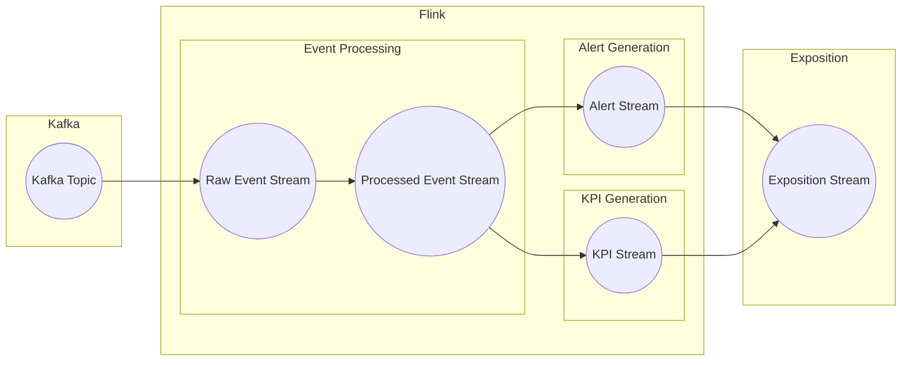

```mermaid
graph LR

subgraph Kafka
    Kafka_Topic((Kafka Topic))
end

subgraph Flink
    subgraph Event Processing
        Raw_Event_Stream((Raw Event Stream))
        Processed_Event_Stream((Processed Event Stream))
    end

    subgraph Alert Generation
        Processed_Event_Stream --> Alert_Stream((Alert Stream))
    end

    subgraph KPI Generation
        Processed_Event_Stream --> KPI_Stream((KPI Stream))
    end
end

subgraph Exposition
    Exposition_Stream((Exposition Stream))
end

Kafka_Topic --> Raw_Event_Stream
Raw_Event_Stream --> Processed_Event_Stream
Alert_Stream --> Exposition_Stream
KPI_Stream --> Exposition_Stream
```