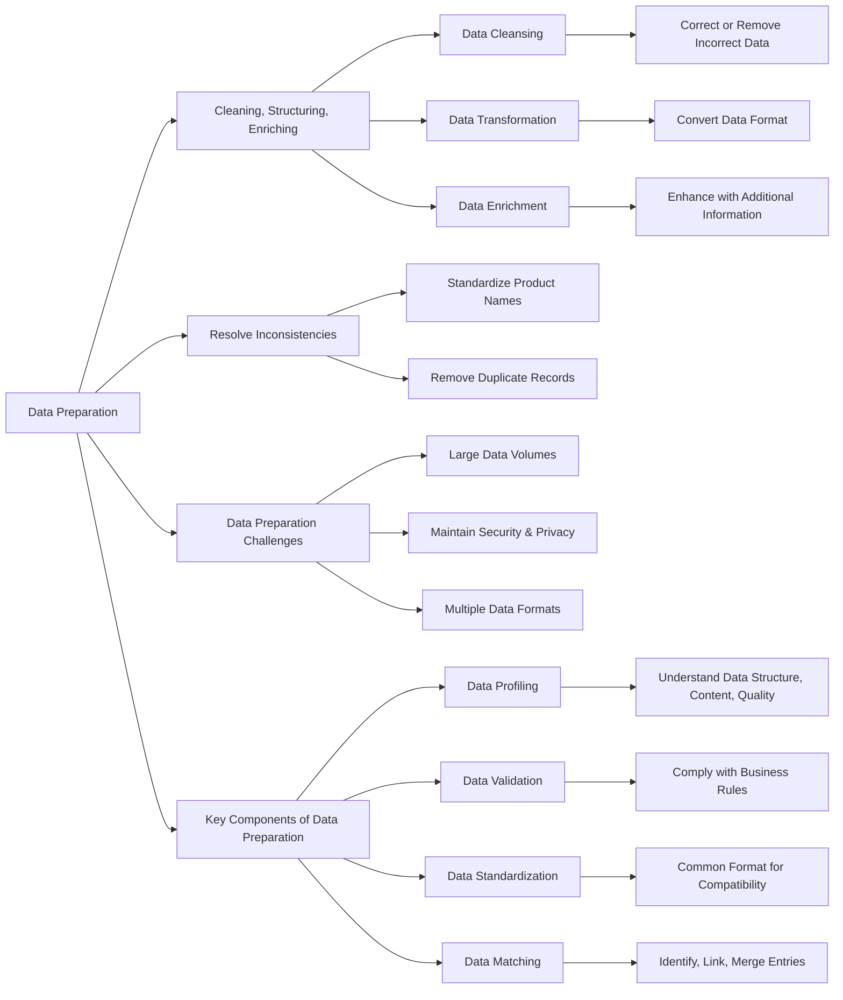

```mermaid
graph LR
    B[Data Preparation]
    B --> C[Cleaning, Structuring, Enriching]
    C --> D1[Data Cleansing]
    C --> D2[Data Transformation]
    C --> D3[Data Enrichment]
    D1 --> E1[Correct or Remove Incorrect Data]
    D2 --> E2[Convert Data Format]
    D3 --> E3[Enhance with Additional Information]
    B --> I[Resolve Inconsistencies]
    I --> J1[Standardize Product Names]
    I --> J2[Remove Duplicate Records]
    B --> K[Data Preparation Challenges]
    K --> L1[Large Data Volumes]
    K --> L2[Maintain Security & Privacy]
    K --> L3[Multiple Data Formats]
    B --> M[Key Components of Data Preparation]
    M --> N1[Data Profiling]
    M --> N2[Data Validation]
    M --> N3[Data Standardization]
    M --> N4[Data Matching]
    N1 --> O1[Understand Data Structure, Content, Quality]
    N2 --> O2[Comply with Business Rules]
    N3 --> O3[Common Format for Compatibility]
    N4 --> O4[Identify, Link, Merge Entries]
```