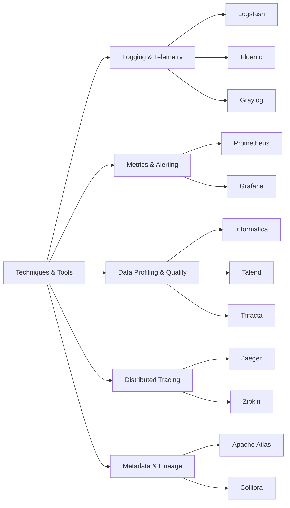

```mermaid
graph LR

    T["Techniques & Tools"]--> L[Logging & Telemetry]
    T --> M[Metrics & Alerting]
    T --> DQ[Data Profiling & Quality]
    T --> DT[Distributed Tracing]
    T --> ML[Metadata & Lineage]
    L --> L1[Logstash]
    L --> L2[Fluentd]
    L --> L3[Graylog]
    M --> M1[Prometheus]
    M --> M2[Grafana]
    DQ --> D1[Informatica]
    DQ --> D2[Talend]
    DQ --> D3[Trifacta]
    DT --> DT1[Jaeger]
    DT --> DT2[Zipkin]
    ML --> ML1[Apache Atlas]
    ML --> ML2[Collibra]
```