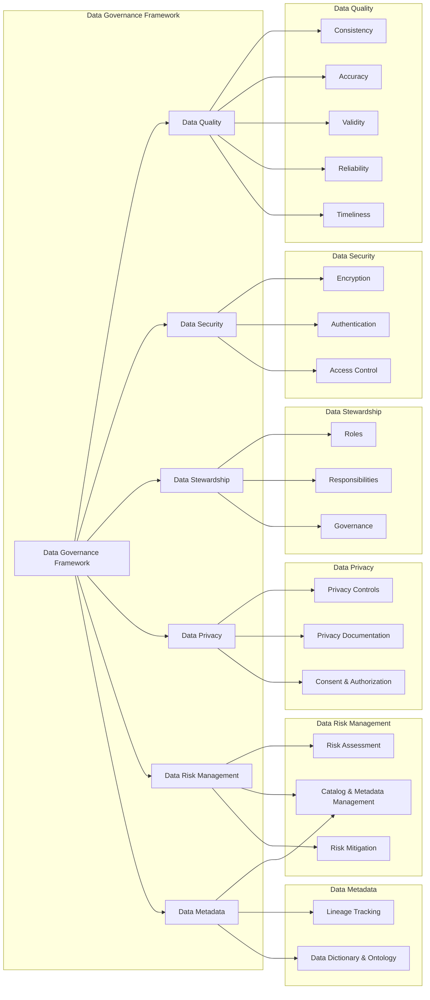

```mermaid
graph LR

subgraph "Data Governance Framework"
    DGF[Data Governance Framework]
    DQ[Data Quality]
    DS[Data Security]
    DST[Data Stewardship]
    DP[Data Privacy]
    DR[Data Risk Management]
    DM[Data Metadata]
    DGF --> DQ
    DGF --> DS
    DGF --> DST
    DGF --> DP
    DGF --> DR
    DGF --> DM
end

subgraph "Data Quality"
    DQ --> C[Consistency]
    DQ --> A[Accuracy]
    DQ --> V[Validity]
    DQ --> R[Reliability]
    DQ --> T[Timeliness]
end

subgraph "Data Security"
    DS --> E[Encryption]
    DS --> AU[Authentication]
    DS --> AC[Access Control]
end

subgraph "Data Stewardship"
    DST --> RO[Roles]
    DST --> RE[Responsibilities]
    DST --> GOV[Governance]
end

subgraph "Data Privacy"
    DP --> PC[Privacy Controls]
    DP --> PD[Privacy Documentation]
    DP --> CA[Consent & Authorization]
end

subgraph "Data Risk Management"
    DR --> RA[Risk Assessment]
    DR --> CM[Compliance Management]
    DR --> RM[Risk Mitigation]
end

subgraph "Data Metadata"
    DM --> CM[Catalog & Metadata Management]
    DM --> LT[Lineage Tracking]
    DM --> DDO[Data Dictionary & Ontology]
end
```