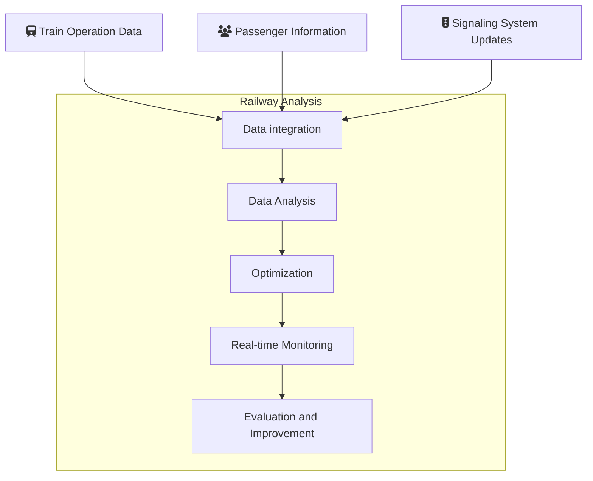

```mermaid
graph TB

AA[fas:fa-train Train Operation Data] --> A
AB[fas:fa-users Passenger Information] --> A
AC[fas:fa-traffic-light Signaling System Updates] --> A

subgraph "Railway Analysis"
    A[Data integration]
    B[Data Analysis]
    C[Optimization]
    D[Real-time Monitoring]
    E[Evaluation and Improvement]
    A --> B
    B --> C
    C --> D
    D --> E
end
```