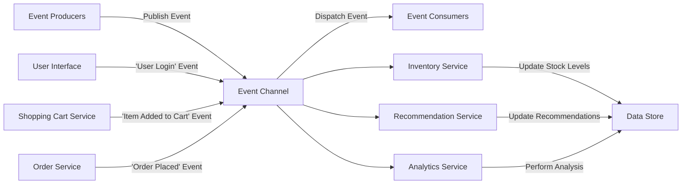

```mermaid
graph LR
    A[Event Producers] -- Publish Event --> B[Event Channel]
    B -- Dispatch Event --> C[Event Consumers]

    A1[User Interface] -- 'User Login' Event --> B
    A2[Shopping Cart Service] -- 'Item Added to Cart' Event --> B
    A3[Order Service] -- 'Order Placed' Event --> B

    B --> C1[Inventory Service]
    B --> C2[Recommendation Service]
    B --> C3[Analytics Service]

    C1 -- Update Stock Levels --> D[Data Store]
    C2 -- Update Recommendations --> D
    C3 -- Perform Analysis --> D

```