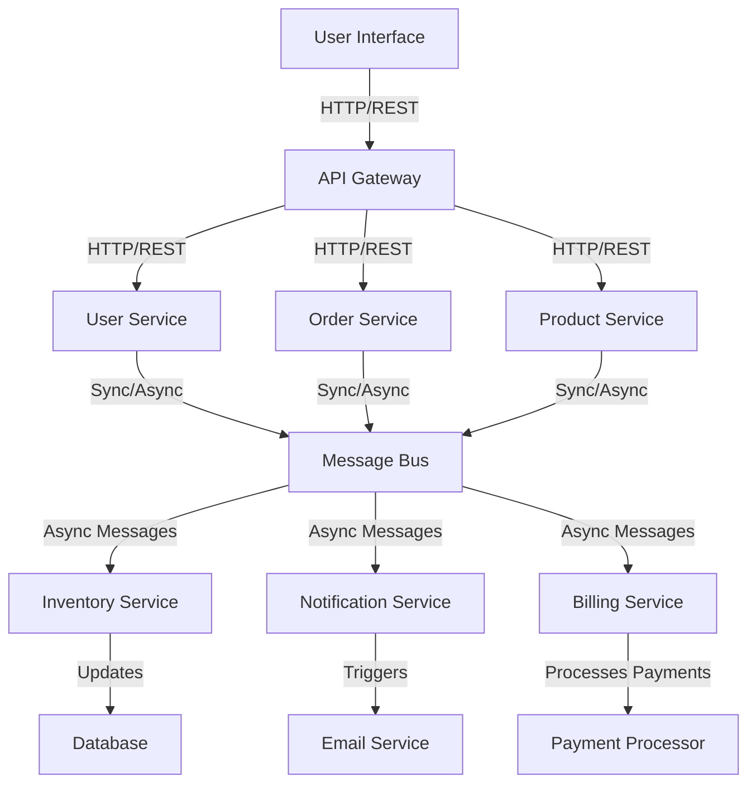

```mermaid
graph TB
    UI[User Interface] -- HTTP/REST --> Gateway[API Gateway]

    Gateway -- HTTP/REST --> UserSvc[User Service]
    Gateway -- HTTP/REST --> OrderSvc[Order Service]
    Gateway -- HTTP/REST --> ProductSvc[Product Service]

    UserSvc -- Sync/Async --> MessageBus[Message Bus]
    OrderSvc -- Sync/Async --> MessageBus
    ProductSvc -- Sync/Async --> MessageBus

    MessageBus -- Async Messages --> InventorySvc[Inventory Service]
    MessageBus -- Async Messages --> NotificationSvc[Notification Service]
    MessageBus -- Async Messages --> BillingSvc[Billing Service]

    InventorySvc -- Updates --> DB[Database]
    NotificationSvc -- Triggers --> EmailSvc[Email Service]
    BillingSvc -- Processes Payments --> PaymentSvc[Payment Processor]

    class UserSvc,OrderSvc,ProductSvc,InventorySvc,NotificationSvc,BillingSvc service;
    class DB database;
    class MessageBus messagebus;
    class EmailSvc,PaymentSvc external;
```