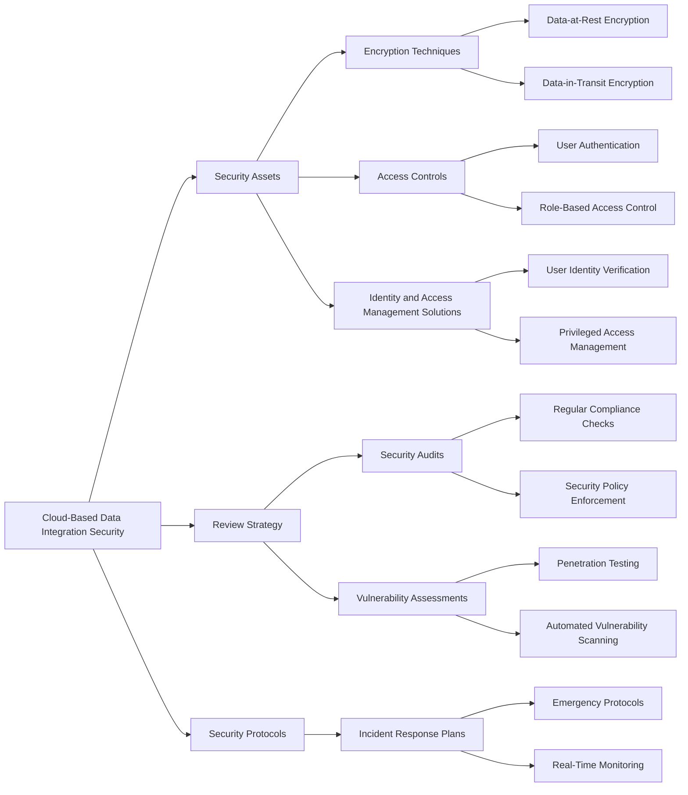

```mermaid
graph LR
    A[Cloud-Based Data Integration Security] --> AA[Security Assets]
    AA --> B[Encryption Techniques]
    AA --> C[Access Controls]
    AA --> D[Identity and Access Management Solutions]
    A --> AB[Review Strategy]
    AB --> E[Security Audits]
    AB --> F[Vulnerability Assessments]
    AC --> G[Incident Response Plans]

    A --> AC[Security Protocols]

    B --> B1[Data-at-Rest Encryption]
    B --> B2[Data-in-Transit Encryption]
    C --> C1[User Authentication]
    C --> C2[Role-Based Access Control]
    D --> D1[User Identity Verification]
    D --> D2[Privileged Access Management]
    E --> E1[Regular Compliance Checks]
    E --> E2[Security Policy Enforcement]
    F --> F1[Penetration Testing]
    F --> F2[Automated Vulnerability Scanning]
    G --> G1[Emergency Protocols]
    G --> G2[Real-Time Monitoring]
```