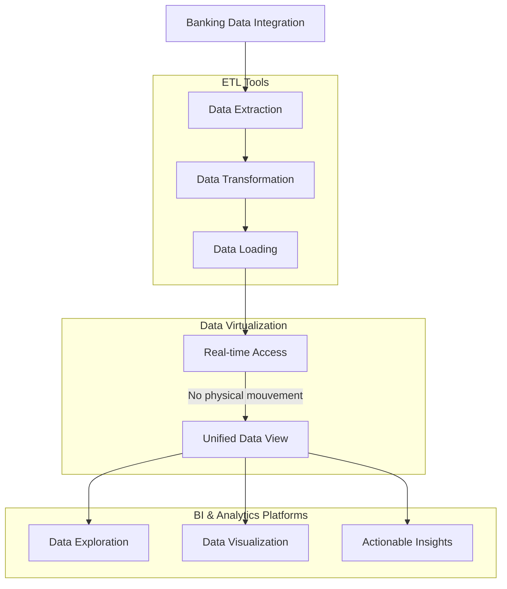

```mermaid
flowchart TD
    B3-->C1[Real-time Access]
    A[Banking Data Integration] --> B1[Data Extraction]
    subgraph ETL Tools
    B1 --> B2[Data Transformation]
    B2 --> B3[Data Loading]
    end
    subgraph Data Virtualization
    C1 -- No physical mouvement --> C2[Unified Data View]
    end
    subgraph BI & Analytics Platforms
    C2 --> D1[Data Exploration]
    C2 --> D2[Data Visualization]
    C2 --> D3[Actionable Insights]
    end
```