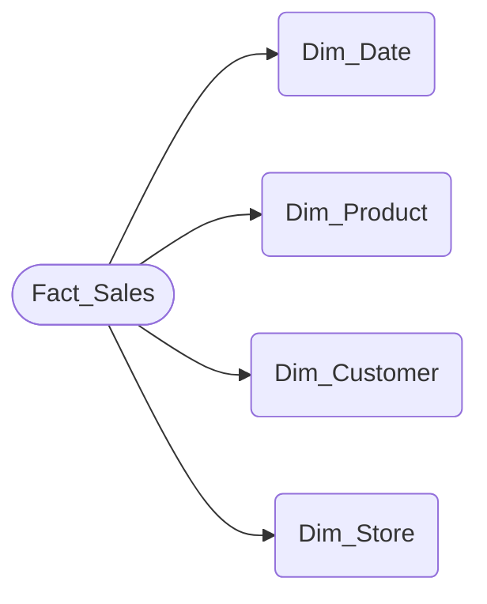

Kimsball star schema concept

In this example, we have a fact table Fact_Sales and dimension tables Dim_Date, Dim_Product, Dim_Customer, and Dim_Store. The arrows indicate the relationships between the fact table and the dimension tables.
