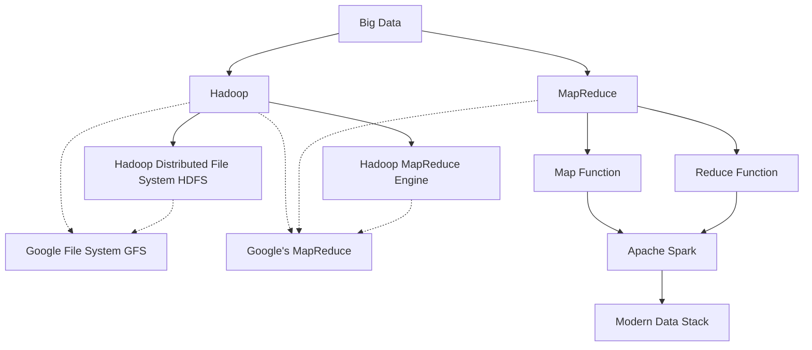

# The Advent of Big Data: Hadoop and MapReduce

This schema illustrates the chapter using the Mermaid syntax. It shows the relationships between the advent of big data, Hadoop, MapReduce, Hadoop Distributed File System (HDFS), Hadoop MapReduce Engine, Google File System (GFS), Google's MapReduce, Map function, Reduce function, Apache Spark, and the modern data stack. The dashed lines represent inspiration or foundation relationships, while the solid lines depict direct connections or development paths.	