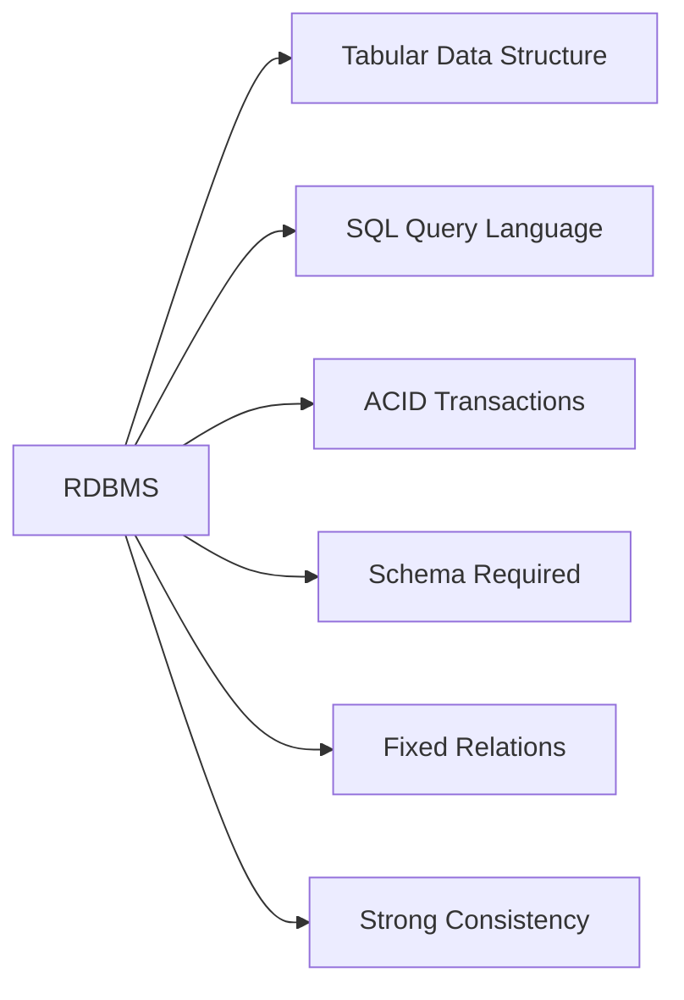

# RDBMS

```mermaid
graph LR
  A[RDBMS] --> B1[Tabular Data Structure]
  A --> B2[SQL Query Language]
  A --> B3[ACID Transactions]
  A --> B4[Schema Required]
  A --> B5[Fixed Relations]
  A --> B6[Strong Consistency]
```

