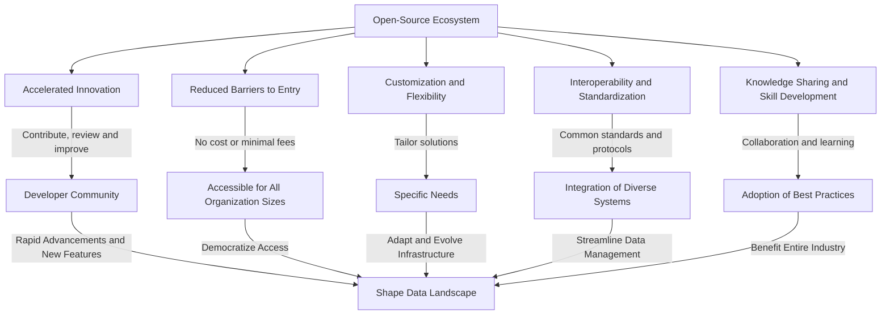

```mermaid
graph TB
    A[Open-Source Ecosystem] --> B[Accelerated Innovation]
    A --> C[Reduced Barriers to Entry]
    A --> D[Customization and Flexibility]
    A --> E[Interoperability and Standardization]
    A --> F[Knowledge Sharing and Skill Development]

    B -->|Contribute, review and improve| G[Developer Community]
    C -->|No cost or minimal fees| H[Accessible for All Organization Sizes]
    D -->|Tailor solutions| I[Specific Needs]
    E -->|Common standards and protocols| J[Integration of Diverse Systems]
    F -->|Collaboration and learning| K[Adoption of Best Practices]

    G -- Rapid Advancements and New Features --> L[Shape Data Landscape]
    H -- Democratize Access --> L
    I -- Adapt and Evolve Infrastructure --> L
    J -- Streamline Data Management --> L
    K -- Benefit Entire Industry --> L
```