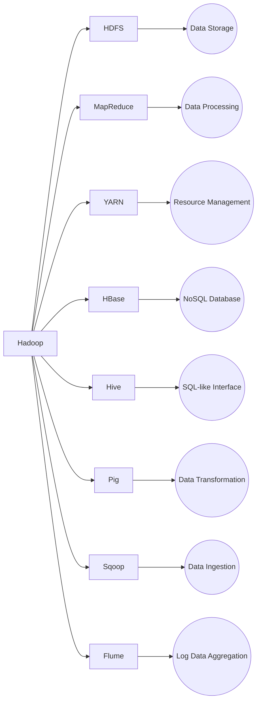

The Hadoop ecosystem and its key components. Hadoop is at the center, with arrows connecting it to each of the ecosystem components: HDFS, MapReduce, YARN, HBase, Hive, Pig, Sqoop, and Flume. Each component is then linked to its primary function.