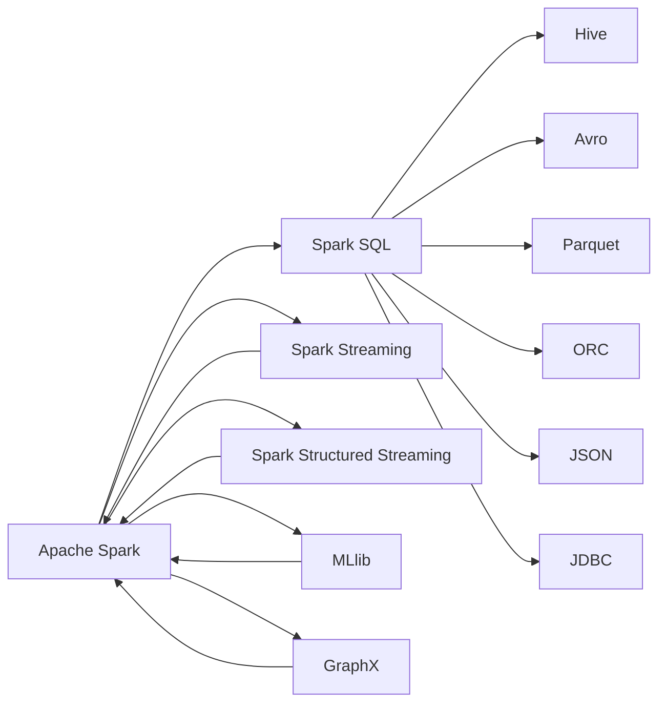

# Spark ecosystem

```mermaid
graph LR
A[Apache Spark] --> B[Spark SQL]
A --> C[Spark Streaming]
A --> D[Spark Structured Streaming]
A --> E[MLlib]
A --> F[GraphX]
B --> G[Hive]
B --> H[Avro]
B --> I[Parquet]
B --> J[ORC]
B --> K[JSON]
B --> L[JDBC]
C --> A
D --> A
E --> A
F --> A
```
