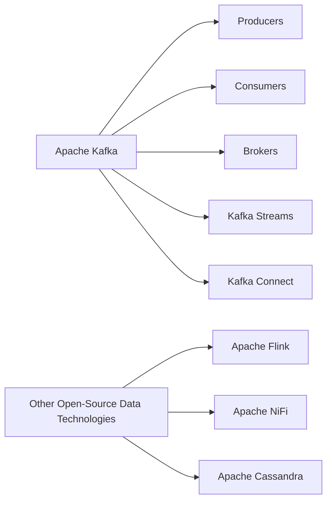

# Kafka ecosystem

This diagram provides a visual representation of the Kafka ecosystem, as well as some other influential open-source data technologies. The main components of the Kafka architecture, such as Producers, Consumers, and Brokers, are connected to the central Apache Kafka node. Additional features, like Kafka Streams and Kafka Connect, are also linked to Apache Kafka. Lastly, the diagram highlights other open-source data technologies, such as Apache Flink, Apache NiFi, and Apache Cassandra.