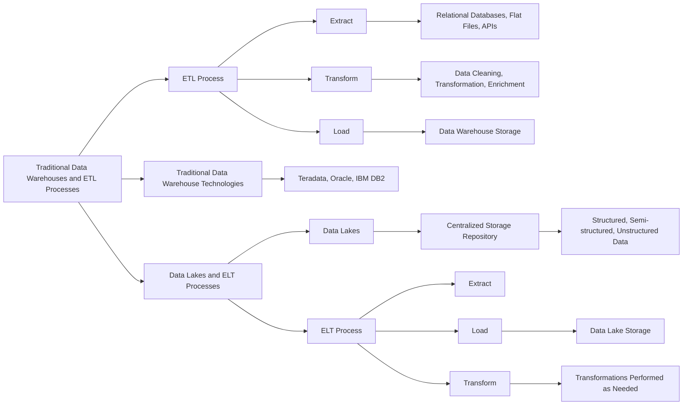
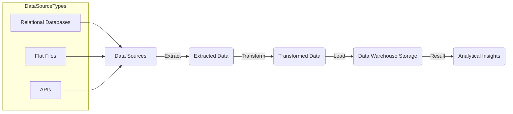
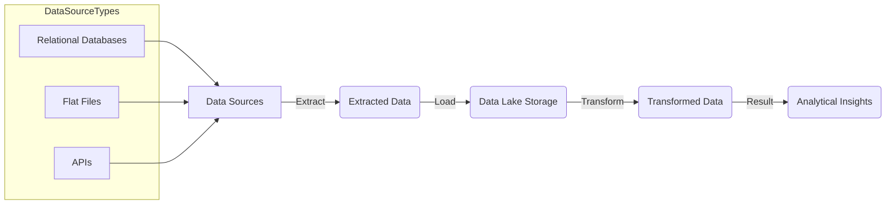

## ETL Process

```mermaid
graph LR
A[Traditional Data Warehouses and ETL Processes] --> B[ETL Process]
B --> C[Extract]
B --> D[Transform]
B --> E[Load]
C --> F[Relational Databases, Flat Files, APIs]
D --> G[Data Cleaning, Transformation, Enrichment]
E --> H[Data Warehouse Storage]
A --> I[Traditional Data Warehouse Technologies]
I --> J[Teradata, Oracle, IBM DB2]
A --> K[Data Lakes and ELT Processes]
K --> L[Data Lakes]
K --> M[ELT Process]
L --> N[Centralized Storage Repository]
M --> O[Extract]
M --> P[Load]
M --> Q[Transform]
N --> R[Structured, Semi-structured, Unstructured Data]
P --> S[Data Lake Storage]
Q --> T[Transformations Performed as Needed]
```

### ETL Process

```mermaid
graph LR
A[Data Sources] -->|Extract| B(Extracted Data)
B -->|Transform| C(Transformed Data)
C -->|Load| D(Data Warehouse Storage)
D -->|Result| E(Analytical Insights)
subgraph DataSourceTypes
A1[Relational Databases]
A2[Flat Files]
A3[APIs]
end
A1 --> A
A2 --> A
A3 --> A
```

### ELT Process

```mermaid
graph LR
A[Data Sources] -->|Extract| B(Extracted Data)
B -->|Load| C(Data Lake Storage)
C -->|Transform| D(Transformed Data)
D -->|Result| E(Analytical Insights)
subgraph DataSourceTypes
A1[Relational Databases]
A2[Flat Files]
A3[APIs]
end
A1 --> A
A2 --> A
A3 --> A

```