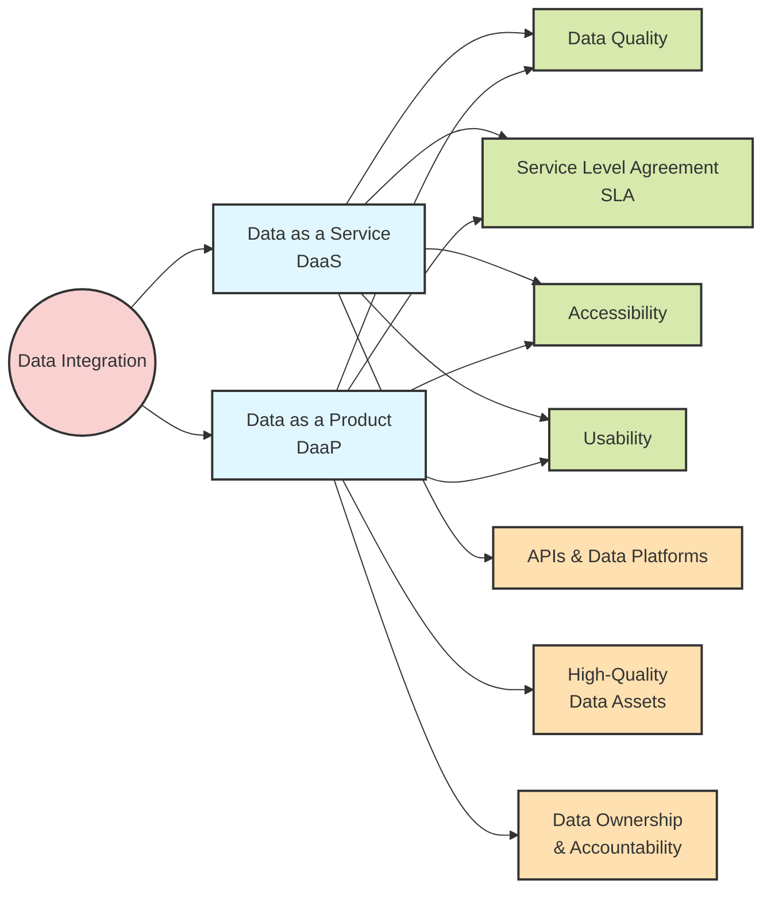

# Dataproducts

```mermaid
graph LR
    A((Data Integration))
    B[Data as a Service <br>DaaS]
    C[Data as a Product <br>DaaP]
    D[Data Quality]
    E[Service Level Agreement <br>SLA]
    F[Accessibility]
    G[Usability]
    H[APIs & Data Platforms]
    I[Data Ownership <br>& Accountability]
    J[High-Quality <br>Data Assets]
    
    A --> B
    A --> C
    B --> D
    C --> D
    B --> E
    C --> E
    B --> F
    C --> F
    B --> G
    C --> G
    B --> H
    C --> J
    C --> I
    
    style A fill:#f9d1d1,stroke:#333,stroke-width:2px
    style B fill:#e1f7ff,stroke:#333,stroke-width:2px
    style C fill:#e1f7ff,stroke:#333,stroke-width:2px
    style D fill:#d7e9ad,stroke:#333,stroke-width:2px
    style E fill:#d7e9ad,stroke:#333,stroke-width:2px
    style F fill:#d7e9ad,stroke:#333,stroke-width:2px
    style G fill:#d7e9ad,stroke:#333,stroke-width:2px
    style H fill:#ffe0b0,stroke:#333,stroke-width:2px
    style I fill:#ffe0b0,stroke:#333,stroke-width:2px
    style J fill:#ffe0b0,stroke:#333,stroke-width:2px


```
