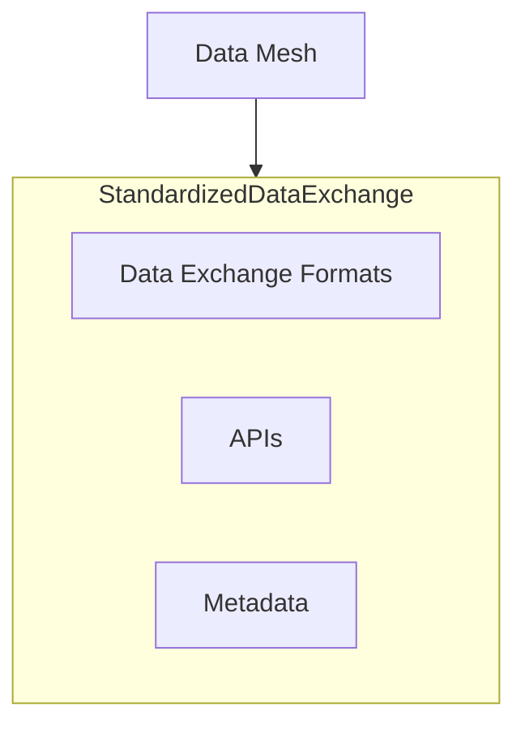
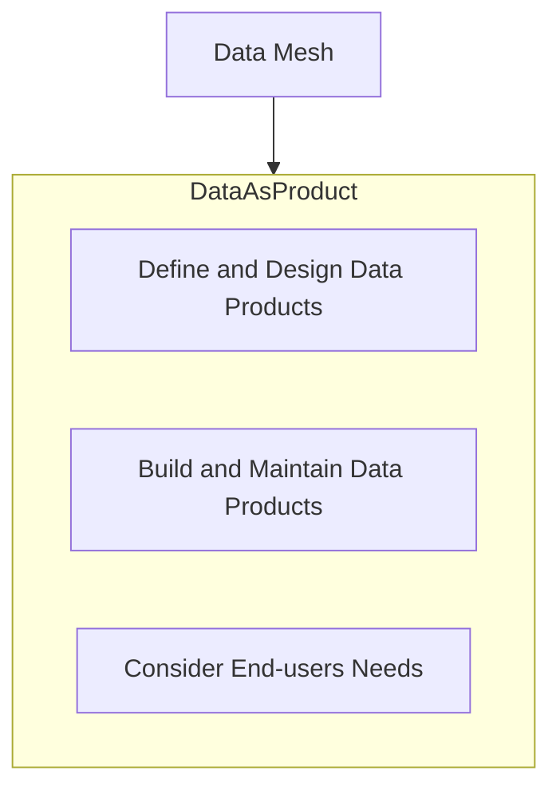

# Datamesh

## Domain oriented ownership

```mermaid
graph TB
DataMesh[Data Mesh] --> DomainOwnership(Domain-oriented Ownership)
subgraph DomainOwnership
    DO1[Team A - Domain Data]
    DO2[Team B - Domain Data]
    DO3[Team C - Domain Data]
end
````

## Decentralized Architecture and Self-serve Data Infrastructure

```mermaid
graph TB
DataMesh[Data Mesh] --> DecentralizedArchitecture(Decentralized Architecture)
DataMesh --> SelfServeInfrastructure(Self-serve Data Infrastructure)

subgraph DecentralizedArchitecture
    DA1[Independent Data Infrastructure A]
    DA2[Independent Data Infrastructure B]
    DA3[Independent Data Infrastructure C]
end

subgraph SelfServeInfrastructure
    SS1[Discover and Access Data]
    SS2[Process and Transform Data]
    SS3[Consume Data for Decision-making]
end

%% Relationship
SelfServeInfrastructure -->|Reduce bottlenecks| DecentralizedArchitecture
```

## Standardized Data Exchange



## Data as a Product

