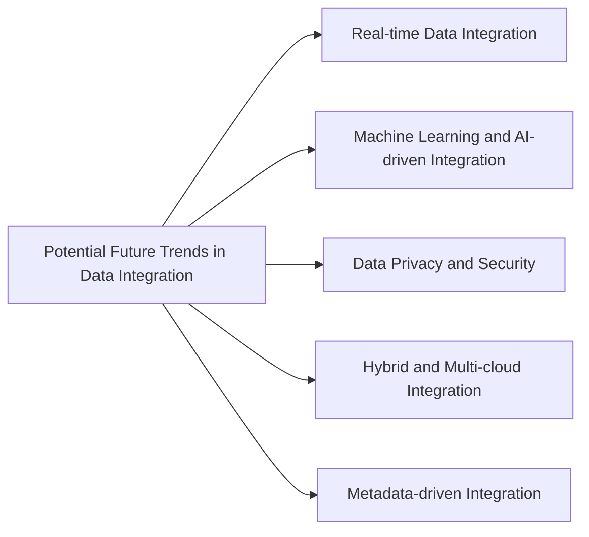

# Future trends of data integration

This diagram illustrates the potential future trends in data integration, including real-time data integration, machine learning and AI-driven integration, data privacy and security, hybrid and multi-cloud integration, and metadata-driven integration.