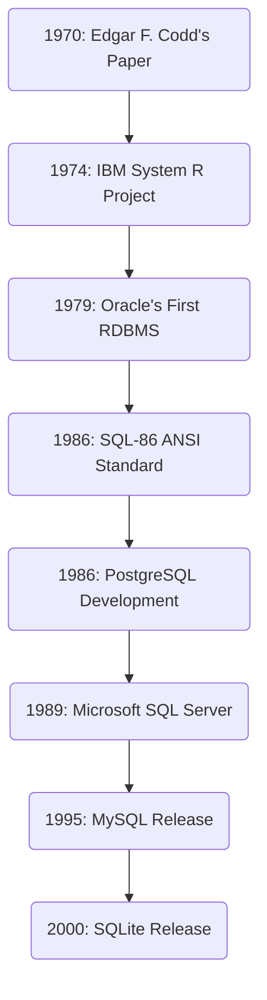

```mermaid
graph TD
A(1970: Edgar F. Codd's Paper) --> B(1974: IBM System R Project)
B --> C(1979: Oracle's First RDBMS)
C --> D(1986: SQL-86 ANSI Standard)
D --> E(1986: PostgreSQL Development)
E --> F(1989: Microsoft SQL Server)
F --> G(1995: MySQL Release)
G --> H(2000: SQLite Release)
```