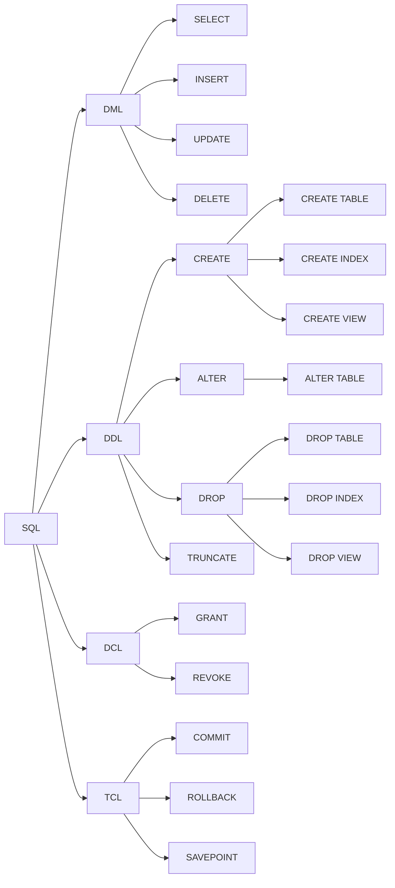

```mermaid
graph LR
A[SQL] --> B1[DML]
A --> B2[DDL]
A --> B3[DCL]
A --> B4[TCL]

B1 --> C1[SELECT]
B1 --> C2[INSERT]
B1 --> C3[UPDATE]
B1 --> C4[DELETE]

B2 --> D1[CREATE]
B2 --> D2[ALTER]
B2 --> D3[DROP]
B2 --> D4[TRUNCATE]

D1 --> E1[CREATE TABLE]
D1 --> E2[CREATE INDEX]
D1 --> E3[CREATE VIEW]

D2 --> F1[ALTER TABLE]

D3 --> G1[DROP TABLE]
D3 --> G2[DROP INDEX]
D3 --> G3[DROP VIEW]

B3 --> H1[GRANT]
B3 --> H2[REVOKE]

B4 --> I1[COMMIT]
B4 --> I2[ROLLBACK]
B4 --> I3[SAVEPOINT]
```