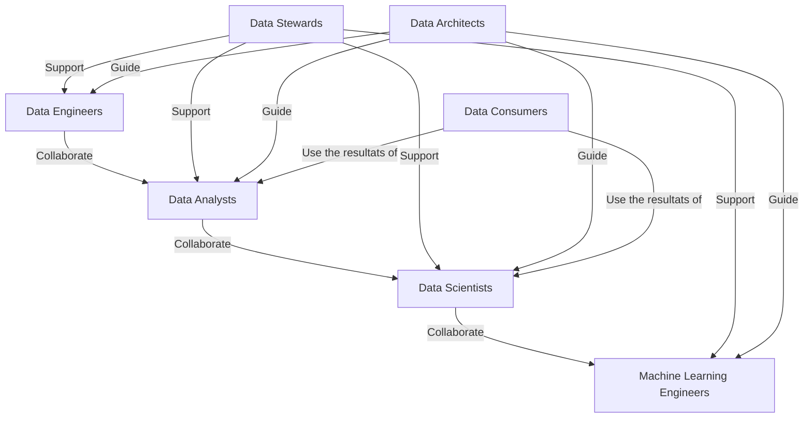

```mermaid
graph TB
    A[Data Engineers] -->|Collaborate| B[Data Analysts]
    B -->|Collaborate| C[Data Scientists]
    C -->|Collaborate| D[Machine Learning Engineers]
    E[Data Stewards] -->|Support| A
    E -->|Support| B
    E -->|Support| C
    E -->|Support| D
    F[Data Architects] -->|Guide| A
    F -->|Guide| B
    F -->|Guide| C
    F -->|Guide| D
    G[Data Consumers] --> |Use the resultats of| B
    G[Data Consumers] --> |Use the resultats of| C
```