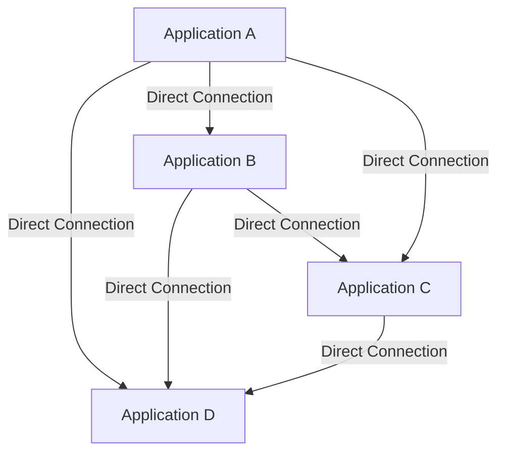

```mermaid
graph TB
  A["Application A"] -- "Direct Connection" --> B["Application B"]
  B -- "Direct Connection" --> C
  A -- "Direct Connection" --> C["Application C"]
  A -- "Direct Connection" --> D["Application D"]
  B -- "Direct Connection" --> D
  C -- "Direct Connection" --> D
```