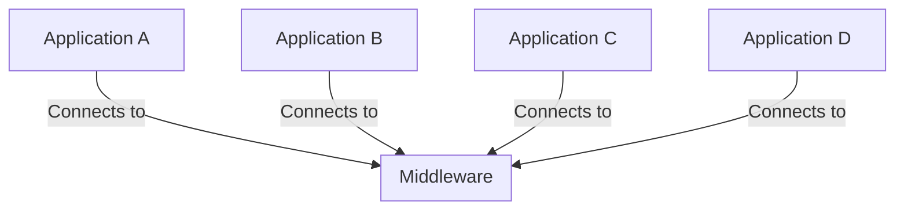

```mermaid
graph TB
  subgraph M["Middleware"]
  end
  A["Application A"] -- "Connects to" --> M
  B["Application B"] -- "Connects to" --> M
  C["Application C"] -- "Connects to" --> M
  D["Application D"] -- "Connects to" --> M
```
